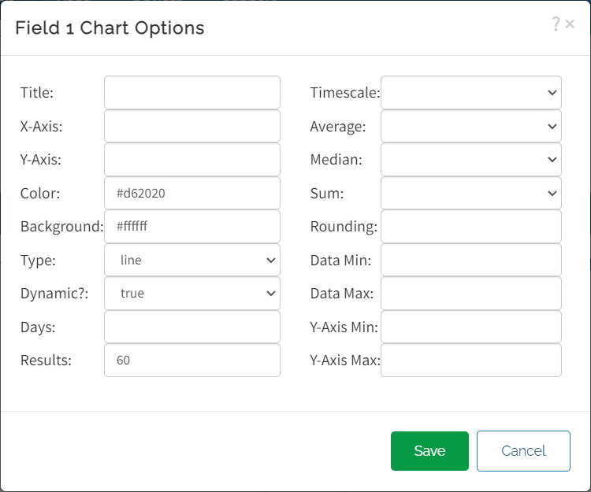

# Exemplo de envio de dados ao ThingSpeak

## Ferramentas utilizadas no projeto

- **ThingSpeak**
- **Arduino IDE**
- **ESP32**

### ThingSpeak

>O **ThingSpeak** é uma plataforma de análise de IoT que permite agregar, visualizar e analisar fluxos de dados ao vivo na nuvem. Você pode enviar dados para o ThingSpeak de seus dispositivos, criar visualização instantânea de dados ao vivo e enviar alertas.

- [Site oficial ThingSpeak](https://thingspeak.com/)

### Arduino IDE

_**Arduino Integrated Development Environment** é uma aplicação de plataforma cruzada, escrito em funções de C e C ++. É usado para escrever e fazer upload de programas em placas compatíveis com Arduino, mas também, com a ajuda de núcleos de terceiros, outras placas de desenvolvimento de fornecedores._

- [Site oficial do Arduino](https://www.arduino.cc/)

### ESP32

*O Módulo ESP32 é um chip microcontrolador desenvolvido pela empresa chinesa **Espressif**. Por possuir Wi-Fi e Bluetooth integrado, esse chip chegou para revolucionar o mercado maker e facilitar as aplicações com projetos IoT, por suas características técnicas e por seu preço acessível.*

- [Site oficial da Espressif](https://www.espressif.com/)

---

## Sobre o projeto

*Este projeto consiste em gerar dados aleatórios em linguagem **C++** e através de um microcontrolador ESP32, realizar conexão a internet e a integração com a plataforma em nuvem ThingSpeak. A plataforma, receberá os dados gerados atráves do ESP32 e realizará a demonstração destes em tempo real em um gráfico.*

## Explicação do código

### Secrects.h

```c++
#define SECRET_SSID "MySSID"
#define SECRET_PASS "MyPassword"

#define SECRET_CH_ID 000000
#define SECRET_WRITE_APIKEY "XYZ"
```
_OBS: Substituir em seu projeto, "MySSID" pelo nome da sua rede e "MyPassword" pela senha da sua rede._

*As variáveis "SECRET_CH_ID" e "SECRET_WRITE_APIKEY" são chaves que você encontrará na plataforma do **ThingSpeak**.*

### envio-dados-thingspeak.ino

```c++
#include <WiFi.h>
#include "secrets.h"
#include "ThingSpeak.h"
```

Importação de arquivos e bibliotecas necessárias para o desenvolvimento da aplicação.

```c++
char ssid[] = SECRET_SSID;
char pass[] = SECRET_PASS;

WiFiClient  client;

unsigned long myChannelNumber = SECRET_CH_ID;
const char * myWriteAPIKey = SECRET_WRITE_APIKEY;

int number1 = random(0,100);
int number2 = random(0,100);
```
Tarefas realizadas no trecho de código acima:

1. Importar dados registrados no arquivo "secrets.h" para as variáveis locais.
2. Instânciar a classe WiFiClient da biblioteca "WiFi.h", reponsável por realizar a conexão com a internet.
3. Inicializar as variáveis que serão enviadas a plataforma na nuvem, de maneira aleatória através da função random.

```c++
void setup() {
  Serial.begin(115200);
  while (!Serial) {
    ;
  }
  
  WiFi.mode(WIFI_STA);   
  ThingSpeak.begin(client);

}
```

**Método setup():** É o módulo normalmente utilizado para realizar as configurações iniciais do mricocontrolador utilizado. Este módulo é obrigatório para a compilação do código. _(Mesmo que seja vazio)._

A função "Serial.begin(115200)" é utilizada pra fazer a inicialização da porta serial da placa utilizada. A porta serial pode ser muito útil no desenvolviemento de aplicações pra microcontroladores, pois pode ser utilizada pra debug, além de entrada e saída de dados.

A função "WiFi.mode(WIFI_STA)" inicializa o WiFi da placa no mode "STATION" ou seja, a ESP32 terá de se conectar a uma estação de Wi-Fi.
A função "ThingSpeak.begin(client)" serve para realizar a integração entre a placa de desenvolviemento e a plataforma **ThingSpeak** através do protocolo _HTTP_ passando como parâmetro a conexão.

```c++
void loop() {

  if(WiFi.status() != WL_CONNECTED){
    Serial.print("Tentando conectar a rede: ");
    Serial.println(SECRET_SSID);
    while(WiFi.status() != WL_CONNECTED){
      WiFi.begin(ssid, pass);
      Serial.print(".");
      delay(5000);     
    } 
    Serial.println("\nConectado.");
  }

  ThingSpeak.setField(1, number1);
  ThingSpeak.setField(2, number2);
  
  int x = ThingSpeak.writeFields(myChannelNumber, myWriteAPIKey);

  if(x == 200){
    Serial.println("Update realizado com sucesso.");
  }
  else{
    Serial.println("Erro de requisição HTTP: " + String(x));
  }
  
  number1 = random(0,100);
  number2 = random(0,100);
  
  delay(20000);
}
```

**Método loop():** Este módulo assim como o "setup()" é obrigatório para a compilação do código. Ele é resposável por realizar as instruções programadas, e funciona em ciclos.

```c++
  if(WiFi.status() != WL_CONNECTED){
    Serial.print("Tentando conectar a rede: ");
    Serial.println(SECRET_SSID);
    while(WiFi.status() != WL_CONNECTED){
      WiFi.begin(ssid, pass);
      Serial.print(".");
      delay(5000);     
    } 
    Serial.println("\nConectado.");
  }
  ```

Esta parte inicial do código, realiza a conexão com a Wi-Fi e enquanto a conexão não for bem realizada com sucesso, o processo é repetido novamente com intervalos de 5 segundos, definido pela função "delay(5000)". 

_OBS: A função delay recebe como parâmetro o tempo em milisegundos, ou seja, 5000 é igual a 5 segundos._

Assim que é realizada a conexão o programa ecreve na saída serial a mensagem "Conectado." e da prosseguimento com o restante do código.

  ```c++
  ThingSpeak.setField(1, number1);
  ThingSpeak.setField(2, number2);
  
  int x = ThingSpeak.writeFields(myChannelNumber, myWriteAPIKey);

  if(x == 200){
    Serial.println("Update realizado com sucesso.");
  }
  else{
    Serial.println("Erro de requisição HTTP: " + String(x));
  }
  
  number1 = random(0,100);
  number2 = random(0,100);
  
  delay(20000);
  ```

A função "ThingSpeak.setField" recebe como parâmetro o número do campo _"configurado no canal criado na plataforma **ThingSpeak**"_ e o valor a ser publicado.

A função "ThingSpeak.writeFields" recebe como parâmentro o número do canal e a chave de escrita _"configurados no arquivo secrets.h"_. Esta função retorna o Response do protocolo HTTP, que é atribuída a variável do tipo inteiro "x".

Na estrutura condicional é testado se x é igual a 200 _"número que retorna do protocolo HTTP caso tudo tenha ocorrido bem"_.
 - Se tudo ocorreu bem, escreve a mensagem "Update realizado com sucesso." na saída serial.
 - Senão escreve a mensagem "Erro de requisição HTTP: " e o código retornado.

Após isso o programa gera novamente números aleatórios para as variáveis, e aguada 20 segundos _"tempo necessário para que o **ThingSpeak** recebá outra requisição"_.

**OBS: O protocolo HTTP possuí diversos retornos para suas requisições, alguns dos mais recorrentes estão disponibilizados na tabela abaixo.***

**Status** | **Resposta**
---------- | ------------
200 | Este é o código de status padrão “OK” para uma solicitação HTTP bem-sucedida. A resposta que é devolvida depende do pedido. Por exemplo, para uma solicitação GET, a resposta será incluída no corpo de mensagens. Para uma solicitação PUT/POST, a resposta incluirá o recurso que contém o resultado da ação.
201 | Este é o código de status que confirma que a solicitação foi bem sucedida e, como resultado, um novo recurso foi criado. Normalmente, este é o código de status que é enviado após uma solicitação POST/PUT.
204 | Este código de status confirma que o servidor atendeu a solicitação, mas não precisa retornar informações. Exemplos deste código de status incluem solicitações de exclusão ou se uma solicitação foi enviada através de um formulário e a resposta não deve fazer com que o formulário seja atualizado ou que uma nova página seja carregada.
304 | O código de status é usado para cache de navegador. Se a resposta não tiver sido modificada, o cliente/usuário pode continuar a usar a mesma versão de resposta/cache. Por exemplo, um navegador pode solicitar se um recurso foi modificado desde um momento específico. Se não o fizer, o código de status 304 será enviado. Se ele tiver sido modificado, um código de status 200 será enviado, juntamente com o recurso.
400 | O servidor não consegue entender e processar uma solicitação devido a um erro do cliente. Dados ausentes, validação de domínio e formatação inválida são alguns exemplos que fazem com que o código de status 400 seja enviado.
401 | Esta solicitação de código de status ocorre quando a autenticação é necessária, mas falhou ou não foi fornecida.
403 | Muito semelhante ao código de status 401, um código de status 403 acontece quando uma solicitação válida foi enviada, mas o servidor se recusa a aceitá-lo. Isso acontece se um cliente/usuário precisar da permissão necessária ou precisar de uma conta para acessar o recurso. Ao contrário de um código de status 401, a autenticação não será aplicada aqui.
404 | O código de status mais comum que o usuário médio verá. Um código de status 404 ocorre quando a solicitação é válida, mas o recurso não pode ser encontrado no servidor. Embora estes estejam agrupados no “balde” de erros do cliente, eles são muitas vezes devido ao redirecionamento inadequado da URL.
409 | Um código de status 409 é enviado quando uma solicitação entra em conflito com o estado atual do recurso. Este é geralmente um problema com atualizações simultâneas, ou versões, que conflitam entre si.
410 | O recurso solicitado não está mais disponível e não estará disponível novamente.
500 | Outro dos códigos de status mais vistos pelos usuários, os códigos de série 500 são semelhantes aos códigos de série 400, pois são códigos de erro verdadeiros. O código de status 500 acontece quando o servidor não pode atender a uma solicitação devido a um problema inesperado. Os desenvolvedores web normalmente têm que vasculhar os registros do servidor para determinar de onde vem o problema exato.

_Destaque especial aos status 200, 404 e 500 que são os três mais recorrentes em requisições HTTP._

---

## Utilização do ThingSpeak

Para a realização deste projeto, é necessário também que algumas configurações sejam realizadas na plataforma **ThingSpeak** para isso acesse o stie [ThingSpeak](https://thingspeak.com/) e crie uma conta, caso ainda não tenha.


Na tela inicial do site, clique no botão "Channels", ele irá reredicionar para a tela de canais do ThingSpeak.
Na tela seguinte "My Channels" clique no botão "New Channel".


Nesta tela são feitas configurações do canal, tais como, nome, descrição, quantidade de campos, nome dos campos, etc.

**_Para a execução deste projeto é são utilizados dois campos, especificamente os campos 1 e 2, pois foi a numeração passada no código._**


Para este exemplo, na tela de configuração o campo um foi nomeado "Temperatura" e o campo dois "Umidade". Por padrão o **ThingSpeak** gera automaticamente gráficos para cada um dos campos configurados.

No cabeçalho dos gráficos, existe uma série de opções, clique no símbolo do lapis, irá abrir configurações do gráfico.



Nesta tela é possível fazer uma série de configurações para o gráfico, como título, cor do fundo, cor do gráfico, limite em X, limite em Y, e tipo de gráfico.

Os tipos suportados são:

- Line
- Bar
- Column
- Spline
- Step


Depois de configurados os gráficos, clique na aba "API Keys" nela contém as informações mais importantes para o desenvolvimento.

### Informações importantes

- [x] Channel ID
- [ ] Author 
- [ ] Access
- [x] Write API Key
- [ ] Read API key

**_Para este projeto utilizaremos apenas estas duas informações!_**
**_Elas devem ser passadas para o arquivo "scrects.h"_**

### Pronto! Se tudo deu certo é só compilar o código, e visualizar os gráficos atualizando em tempo real no ThingSpeak!


---
